# INFIWORLD System Architecture

This document provides a high-level overview of the INFIWORLD Crypto Hub's system architecture, detailing how different components interact with each other.

## System Diagram

```mermaid
graph TD
    Client[Client Browser] --> FrontendApp[Frontend App]
    
    subgraph "Frontend Application"
        FrontendApp --> Pages[Pages]
        FrontendApp --> Components[UI Components]
        FrontendApp --> Hooks[Custom Hooks]
        Pages --> AuthPage[Authentication]
        Pages --> MarketplacePage[Marketplace]
        Pages --> FreelancePage[Freelance]
        Pages --> MapPage[Map View]
        Pages --> ReservationsPage[Reservations]
        Pages --> TransactionsPage[Transactions]
        Pages --> ProfilePage[User Profile]
        Pages --> VerificationPage[Verification]
    end
    
    FrontendApp --> AuthModule[Authentication Module]
    FrontendApp --> PaymentModule[Payment Module]
    
    AuthModule --> SupabaseAuth[Supabase Auth]
    PaymentModule --> TransactionProcessing[Transaction Processing]
    PaymentModule --> EscrowSystem[Escrow System]
    
    subgraph "Backend Services"
        SupabaseDB[Supabase Database] --> UserData[User Data]
        SupabaseDB --> ListingData[Listings Data]
        SupabaseDB --> TransactionData[Transaction Data]
        SupabaseDB --> StoreData[Store Data]
        SupabaseDB --> ReservationData[Reservation Data]
        
        EdgeFunctions[Supabase Edge Functions] --> PaymentProcessing[Payment Processing]
    end
    
    subgraph "External Services"
        MapboxAPI[Mapbox API]
        CryptoPaymentGateways[Crypto Payment Gateways]
        ThirdPartyAuth[Third-party Auth Providers]
    end
    
    FrontendApp --> SupabaseDB
    FrontendApp --> EdgeFunctions
    MapPage --> MapboxAPI
    PaymentModule --> CryptoPaymentGateways
    AuthModule --> ThirdPartyAuth
```

## Core Components

### Client-Side Application

1. **Pages**
   - **Authentication (Auth.tsx)**: User login and signup functionality
   - **Marketplace (Marketplace.tsx)**: Product listings for buying and selling
   - **Freelance (Freelance.tsx)**: Services marketplace for freelancers
   - **Map View (Map.tsx)**: Interactive map of crypto-friendly stores
   - **Reservations (Reservations.tsx)**: Booking system for services
   - **Transactions (Transactions.tsx)**: History of user transactions
   - **User Profile (Profile.tsx)**: User account management
   - **Verification (Verification.tsx)**: User identity verification

2. **Core Modules**
   - **Authentication Module**: Manages user sessions and authentication state
   - **Payment Module**: Handles payment processing and transaction management

### Backend Services (Supabase)

1. **Database Collections**
   - **Users**: User profiles and authentication data
   - **Listings**: Marketplace product listings
   - **Transactions**: Payment transaction records
   - **Escrow Transactions**: Escrow payment records
   - **Stores**: Store location and information
   - **Reservations**: Service booking information

2. **Edge Functions**
   - **process-payment**: Serverless function for payment processing

### External Services

1. **Mapbox API**: Provides mapping functionality for the store locator
2. **Crypto Payment Gateways**: External services for processing cryptocurrency payments
3. **Third-party Authentication**: Optional authentication providers

## Data Flow

1. **User Authentication**
   - User credentials → Auth Module → Supabase Auth → User Session

2. **Marketplace Transactions**
   - Listing Selection → Payment Module → Transaction Processing → Supabase Database

3. **Escrow Payments**
   - Payment Initiation → Escrow System → Funds Locked → Service Delivery → Funds Released

4. **Store Locator**
   - User Location → Map Component → Mapbox API → Store Filters → Display Stores

## Security Architecture

- **Authentication**: JWT-based authentication using Supabase Auth
- **Input Sanitization**: Security utilities for preventing XSS attacks
- **CSRF Protection**: Token-based protection for form submissions
- **PCI Compliance**: Display of security badges for payment confidence

This architecture is designed to be scalable, with clear separation of concerns between components and services.
